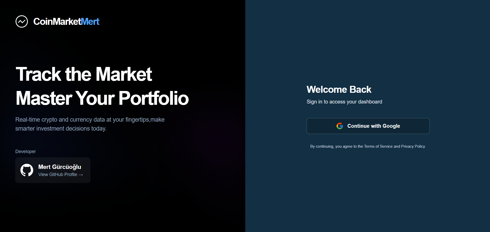
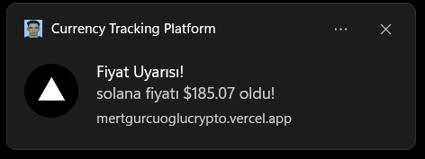

# 💸 Crypto Currency Tracker

This project is a web platform that allows users to track live exchange rates from multiple sources.

---

## LIVE

> **⚠️ Update:** The backend services (hosted on AWS) are currently **paused** to avoid incurring costs after the Free Tier limit.
>
> While the [Vercel Frontend](https://mertgurcuoglucrypto.vercel.app) is accessible, it will not show live data without the backend running.

👉 **To see the project in action:**
1. Check the **[Screenshots](#-screenshots)** section below.
2. Or run the project locally using **Docker** (see instructions below).

---

## 🚀 Features

* Live exchange rate tracking
* User login and portfolio creation
* Alerts for favorite exchange rates

---

## 🛠️ Tech Stack

The following technologies were used in the development of this project:

* **Frontend:** Next.js, React, Tailwind CSS
* **Backend:** Java, Spring Boot, Spring Cloud
* **Database:** MongoDB, PostgreSQL
* **Deployment:** Docker, AWS, Vercel
* **Other:** Eureka Server, API Gateway

---

## 🏁 Getting Started (Local Setup)

This project is fully containerized with Docker. The easiest way to get started is by using Docker Compose.

### Option 1: Running with Docker (Recommended)

This method will build and run all services (backend, frontend, etc.) defined in the `docker-compose.yml`.

**Prerequisite:**

* Docker & Docker Compose installed.

**Steps:**

1.  **Clone the repository:**
    ```bash
    git clone https://github.com/MertGurcuoglu/cryptocurrencytracker
    
    cd cryptocurrencytracker
    ```

2.  **Create the main environment file:**
    Copy the example file to create your local environment configuration.
    ```bash
    cp .env.example .env
    ```

3.  **Edit the `.env` file:**
    Open the newly created `.env` file and fill in your secrets (MongoDB URI, API keys, etc.).

4.  **Build and run with Docker Compose:**
    ```bash
    docker-compose up -d --build
    ```

The application should now be running.

* **Frontend:** `http://localhost:3000`
* **Backend:** `http://localhost:8080`

---

### Option 2: Running Manually (for Development)

If you prefer to run services manually without Docker, follow these steps.

#### Prerequisites (for Manual Setup)

* Java 17+ or later
* Node.js v18+ or later
* MongoDB Atlas account or a local MongoDB instance

#### 1. Backend Setup (API)

*Note: These steps must be repeated for each backend microservice (e.g., `api-gateway`, `currency-service`, etc.).*

```bash
cd [path-to-your-backend-service-folder]
cp src/main/resources/application.properties.example src/main/resources/application.properties
# Now, edit 'application.properties' with your own secrets
./mvnw spring-boot:run
```

#### 2. Frontend Setup (Web Interface)

```bash
cd frontend
npm install
cp .env.example .env.local
# Now, edit '.env.local' and set the NEXT_PUBLIC_API_URL
npm run dev
```

---

## 📸 Screenshots

**LoginPage**




**DashboardPage**


**Notification**



---

## 👤 License

This project is licensed under the **GPLv3 License**.
